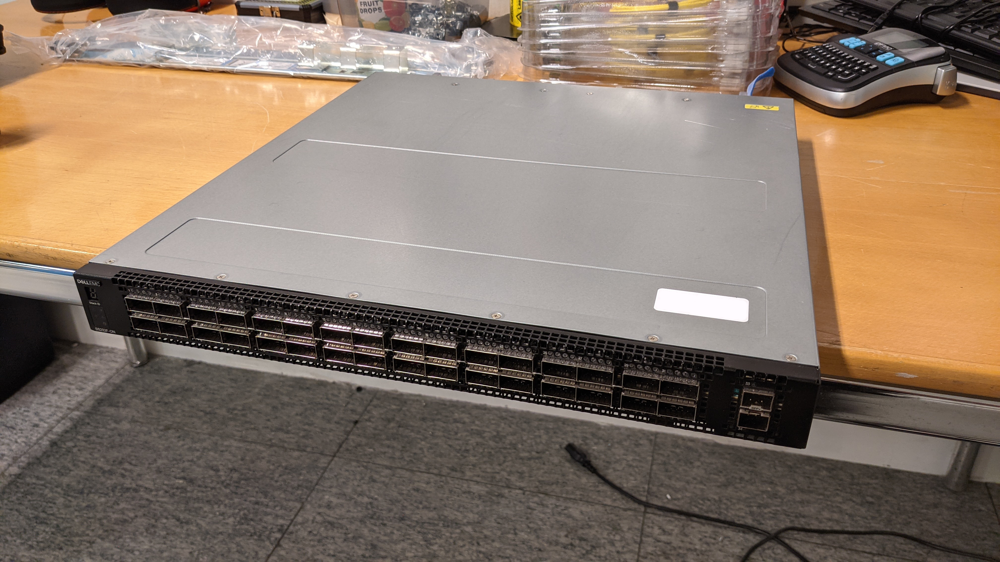
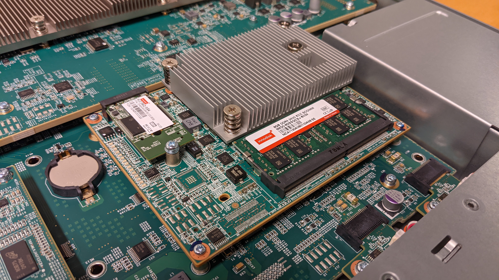
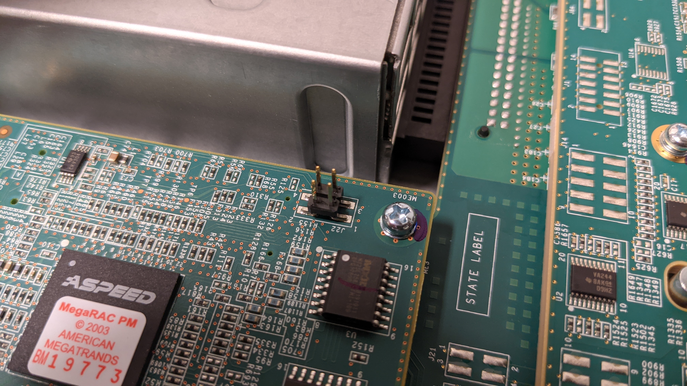
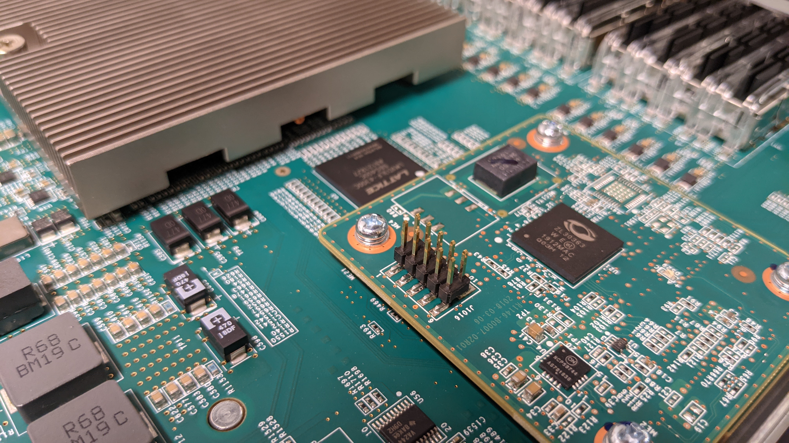
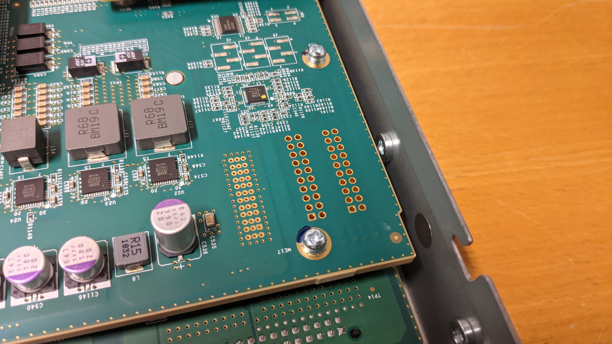

# Dell EMC S5232F-ON

Control-plane:
- CPU: Intel Atom C3538 4-core 2.10Ghz
- Memory: 2x Innodisk 8GB DDR4 2400 ECC SODIMM "M4D0-8GSSQCSJ-B039"
- Storage: Innodisk 64GB M.2 SATA "(S42) 3IE4"
- Management: 1x 1GBase-T
- Serial: 115200 8N1
- BMC: ASPEED
- PSU: 2x 750W
- Misc: 1x USB

Data-plane:
- ASIC: Broadcom Trident3-X7 "BCM56870"
- Layout: 32x SFP28, 2x SFP+

TODO

